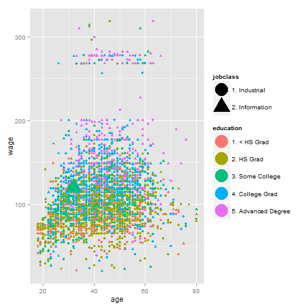

## Introduction

Do you live in the mid-atlantic region of the United States? Are you a male of working age? Have you ever wanted to see how your salary compares to people with similar traits? (I know, quite specific but I am working on that..)

#### If you answered yes to those questions then this site is for you! 

--- .class #id

## What is going on here??

I have created a website that allows people to enter in some basic information and based upon these metrics, they can visualize how their current income compares to other similar people who live in the same area!

You can access the application by going here: https://jarpino.shinyapps.io/Developing-Data-Products

--- 

## How does this work?

Simple! Using the controls in the left panel select the criteria that you wish to filter on. As you do, the diagrams and data below will update to show how you stand out in the pack!

An example graph is shown here:

 

--- 

## So... how accurate is this? 

Actually, this is not really that accurate. This does show you where your information sits in the dataset, but the dataset is limited to just 3000 observations and is a few years old. You can find out more about this dataset in the R ISLR package from the book: Introduction to Statistical Learning.

#### ... is this it?

Hardly! 
Well actually right now, yes that is all that this application does. But I am looking for some more funding to continue developing this application. What will I do with this funding? Good Question!

1. Increase the size of the dataset to include more people from more diverse geographic regions
2. Incrase the number of metrics people can use to measure themselves against.
3. Give users additional ways to visualize and explore the data.
4. Give users the ability to download their results or the raw data for offline further exploration.
5. ... Profit!

